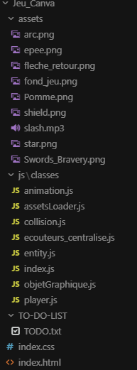

# Jeux Web MIAGE L3 - Projet CANVAS

Créateur :  
- Fouilloud Valentin 

## 1. Description du projet 

Ce dépôt contient mon jeu réalisé en HTML5 Canvas et Javascript dans le cadre du cours Introduction au développement Web.
Le jeu propose 3 modes :
- Le mode Combat : Le joueur utilise les flèches directionnels pour pouvoir taper les pommes et les étoiles afin de faire grimper son score.
- Le mode Défense : Le joueur doit bouger sa souris pour positionner son bouclier afin de se défendre contre les pommes arrivant de toutes les directions.
- Le mode Archerie : Le joueur doit tirer sur des pommes en mouvement avec qu'elles ne l'atteignes.

Fonctionnalités : 
- Gestion des scores (record, dernier score, et score actuel avec le combo)
- Menu gestion des mini-jeux
- Difficulté progressive

## 2. Organisation du projet

Conception orientée objet :
- ObjeGraphique.
- Player extends ObjetGraphique.
- Entity extends ObjetGraphique.
- Star et pomme extends Entity.

La logique est répartie entre classes métier, index.js pilote seulement les états et appelle les méthodes des objets.

## 3. Bonnes pratiques 

### 3.1 Canvas - Utilisation de ctx.save() et ctx.restore()
- Chaque bloc de dessin modifiant le contexte est encadré par ctx.save() et ctx.restore().
- Utilisation dans drawMenu(),drawChoix(),drawScoreAndCombo()...

### 3.2 Transformation géométrique respectant le MOOC HTML5
- Utilisation ctx.translate() puis ctx.rotate() en partant comme si l'objet était de base en 0,0.
- Exemple dans le projet avec le bouclier, les flèches, l'arc, l'épée ...

### 3.3 Animation 60 fps 
- La boucle d'animation est unique GameLoop avec requestAnimationFrame(GameLoop).
- Pas de setIntervalle utilisé.

### 3.4 Écouteurs centralisés  
- Fichier spécialement pour ça.  
- Utilisation pour les flèches directionnels de l'écouteurs dans le cours.  
- La séparation est claires les écouteurs ne font qu'enregistré les entrées tandis que la logique reste dans index.js.

### 3.5 Gestion des états
- Les états dans le jeu sont : MENU, CHOIX, COMBAT, DEFENSE, ARCHERIE selon l'état la GameLoop appelle les bons dessins (drawMenu() ...)
- Chaque mode à sa propre logiques avec des timers différents des difficultés différentes

## 4. Ce dont je suis fièr

- Trois modes de jeu avec des mécaniques différentes tout en réutilisant les mêmes assets et la même structure
- Architecture propre avec la séparation de tout comme il faut
- Rendu correcte, même si il manque le design tout est jouable et c'est plaisant a jouer
- Collision réussi avec beaucoup d'essai et de test différents
- Gestion des scores réussis

## 5. Difficultés rencontrées

- Positionnement des design via translate et rotate (épée, bouclier, arc et les flèches)
- Sauvegarde des scores après avoir cliqué sur le bouton retour
- Calcul mathématique pour les positions des objets
- Gestion de la difficulté, avec le temps de spawn des entités
- Séparation des listeners dans un autre fichier au lieu de tout mettre dans l'index.js
- Gestion du hover avec le problème lié aux positions (résolu grâce à isInside())

## 6. Ressources externes et références

- MOOC avec les chapitres sur le design 2D, l'animation et les transformations géométriques
- GitHub du cours avec le code qui m'a beaucoup aidé
- img prises sur internet dont j'ai retiré le fond
- Sites comme https://developer.mozilla.org/fr/docs/Web/API/CanvasRenderingContext2D/beginPath#:~:text=beginPath()%20de%20l'API,voulez%20cr%C3%A9er%20un%20nouveau%20chemin.
- StackOverflow aussi m'a beaucoup aidé ainsi que des forums sur des choses spécifiques comme les calculs de pythagore par exmple

## 7. Utilisation d'outils IA

- Outil : Gemini et gitHub copilot
- Les parties concernées sont tout ce qui touche à la refactorisation des écouteurs (de base j'avais mit les écouteurs d'évenement dans le index.js), la logique des collisions à été nettement améliorer grâce a l'IA, la gestion du gameState par rapport aux scores aussi, l'aide par rapport au hover avec isInside(). La gestion de la difficulté à été équilibré par rapport à ce que j'avais fait. Les calculs mathématique pour l'archerie environ 50% de la logique de tir à été faite grâce à l'IA.
- Prompts du style : "Déplace moi les écouteurs dans ma classe ecouteurs_centralisé.js sans utiliser gameContext je veux que la logique reste dans index.js et les écouteurs enregistre seulement les cliques, la souris qui bouge etc...), "j'ai un problème avec le tir de mon arc, ma flèche traverse plusieurs pommes en même temps pourrais-tu faire en sorte que quand le bout de ma flèche touche une pomme elle disparaisse avec la pomme stp", "Quand je fais 100 de score dans le mode combat il reste même quand j'appui sur le bouton retour et que je vais dans le mode Défense, j'aimerais que quand on clique dessus le score et le combo reset quand on switch de mini-jeu", "J'ai du mal pour faire le survol du bouton play ou retour avec le changement du pointer en cursor, tu pourrais me créer une fonction qui compare les positions qui s'appelle isInside(p1,p2) stp", "Améliore moi la gestion de la difficulté stp, je trouve que le jeu devient trop dur trop vite, j'aimerais ralentir cela, mon problème est que j'utilise la même difficulté pour chaque mode et c'est pas adapté, tu pourrais me faire 3 logiques différentes pour les 3 jeux avec des difficultés distincts stp", "Génère moi des commentaires au dessus des fonctions pour expliquer la fonctionnalité de la fonction stp".
- Le code généré a été vérifié et des corrections ont été faites pour respecter les bonnes pratiques.

## 8. Installation et lancement

- Ouvrir le projet dans un IDE (genre Vs Code)
- Installer l'extension Go Live
- Lancer en Go Live et c'est prêt !

## 9. Résumé 
- Organisation : classes et sous-classes respectant la COO
- Canvas : utilisation de ctx.save()/ctx.restore(), translate()/rotate()
- Animation : Une GameLoop avec requestAnimationFrame(GameLoop) uniquement
- Écouteurs : centralisés dans ecouteurs_centralise.js (clavier + canvas), logique du jeu dans index.js
- États : gameState pour gérer les écrans + listes et timers par mode pour les entités comme les pommes, les étoiles et les flèches.
- README détaillé : ressources externes, outils IA documentés et procédure de lancement du jeu.
